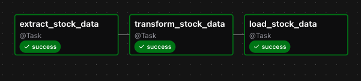
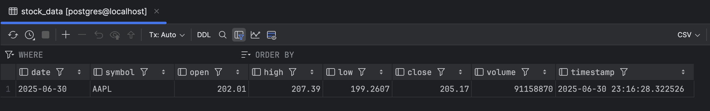

# ETL Pipeline - Daily Stock Data

This project aims to build an ETL pipeline using the Astronomer CLI and Apache Airflow to extract daily stock price data (Apple, in this case) and load it into a PostgreSQL database. The goal is to showcase how a modular and schedulable pipeline can automate data ingestion for time-series financial data.

## Table of Contents

- [Installation](#installation)
- [Usage](#usage)
- [Results](#results)
- [License](#license)
- [Contact](#contact)

## Installation

```bash
# Clone the repository
git clone https://github.com/joao-pedro-afonso/etlpipeline-stocks.git
cd etlpipeline-stocks

# Install dependencies
pip install -r requirements.txt

# Install astro -> go to https://www.astronomer.io/docs/astro/cli/install-cli

# Start the local Airflow environment
astro dev start

# Opens Airflow window -> go to Admin and Connections -> create Connections to APIs and Database
```

## Project's Structure

This project has multiple folders and files in order to configure every aspect to create the ETL Pipeline.

The workflow DAGs are located in the dags/ folder.

Some API tests were conducted and are included in the tests/ folder.

## Results

The data pipeline worked successfully. Below it is possible to see the DAG used and the table correctly deployed in a postgres database (visualization using DataGrip).






## License

This project is licensed under the [MIT License](LICENSE).

## Contact

João Afonso - [jpcdma@gmail.com](mailto:jpcdma@gmail.com)
